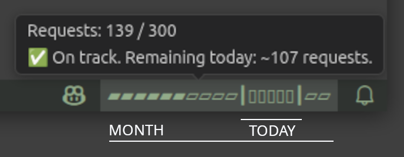
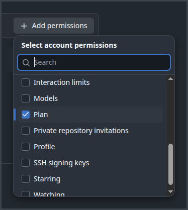

# Pacer for GitHub Copilot

A lightweight VSCode extension that lets you easily track your GitHub Copilot premium requests. It adds a convenient, distraction-free indicator directly to your status bar, so you can monitor your monthly quota and daily usage at a glance without interrupting your workflow.

> ⚠️ **Note:** This extension currently supports **GitHub Copilot Individual** plans. If you are on a Copilot Business or Enterprise plan, your usage is tied to your organization's billing, and a personal token will correctly (but unhelpfully) report `0` usage.

## Why this exists?
Standard percentage metrics (e.g., "Used 37%") lack daily context. They don't tell you if you're burning through your limits too fast today or if you have a huge buffer saved up.

This extension replaces abstract percentages with a visual pacing bar. It shows exactly where you stand relative to today's date, helping you pace your usage perfectly throughout the month.

## Features
* **Visual Pacing Bar:** The progress bar is dynamically split into three clear zones:
  * **Past usage:** Requests you've already spent.
  * **Today's Bracket `[▮▮▯▯▯]`:** Your specific budget window for *today*.
  * **Future quota:** The remaining requests for the rest of the month.
* **Smart Tooltip:** Hover over the status bar to see exact numbers, including your exact "debt" or how many requests you have safely left for the day.
* **Privacy-First:** Your GitHub token is securely stored in VSCode's native encrypted `SecretStorage`. It is never written to plain-text settings or files.
* **Set and Forget:** The indicator automatically refreshes in the background. Click on the status bar to refresh it manually anytime.

## Setup: The "Unpleasant" Part (Getting a PAT)
Because GitHub does not provide a public API for individual Copilot usage, this extension needs a GitHub Personal Access Token (PAT) to fetch your billing numbers.

🛡️ **Privacy Guarantee:** **This token CANNOT read your code, your repositories, or your Copilot prompts.** It only needs permission to read the raw numbers from your billing usage endpoint. The extension makes direct requests to `api.github.com` and nowhere else.

### How to get and set your token:
1. Go to your GitHub [Fine-grained Personal Access Tokens](https://github.com/settings/tokens?type=beta) page.
2. Click **Generate new token**.
3. Name it (e.g., "VSCode Copilot Pacer").
4. Scroll down to **Account permissions**. Find **Plan** and set it to **Read-only** (if unavailable, leaving all scopes empty often works for basic billing retrieval).
5. Generate the token and copy it.
6. Open VSCode, press `Ctrl+Shift+P` (`Cmd+Shift+P` on Mac), type **"Copilot Pacer: Set GitHub Token"** and paste your token. Alternatively, you can click the indicator in the status bar to set your token directly.

## Extension Settings

| Setting | Default | Description |
|---|---|---|
| `copilot-pacer.monthlyLimit` | `300` | Your monthly Copilot premium request limit |
| `copilot-pacer.username` | _(auto-detected)_ | Your GitHub username — populated automatically on first run |

The GitHub PAT is **not** stored in settings. Use the **Pacer: Set GitHub Token** command to update it.

## Commands

| Command | Description |
|---|---|
| `Pacer: Set GitHub Token` | Securely store or replace your GitHub PAT |
| `Pacer: Refresh` | Force an immediate usage refresh |

## License
[MIT](LICENSE)
