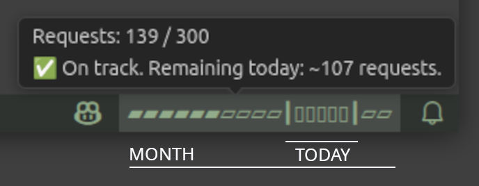
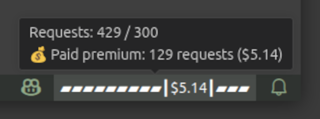

# Pacer for GitHub Copilot

A lightweight VSCode extension that lets you easily track your GitHub Copilot premium requests. It adds a convenient, distraction-free indicator directly to your status bar, so you can monitor your monthly quota and daily usage at a glance without interrupting your workflow.

## Why this exists?
Standard percentage metrics (e.g., "Used 37%") lack daily context. They don't tell you if you're burning through your limits too fast today or if you have a huge buffer saved up.

Pacer solves this by merging a **usage progress bar** with a **monthly calendar timeline**.

Imagine your monthly quota as a single timeline. We place two markers `┃` on this timeline to represent the start and end of *today*. Since today is what matters most, the UI acts as a "lens" that zooms in on this specific section.

## Features
* **Visual Pacing Bar:** The status bar indicator (e.g., `▰▰┃▮▮▯▯▯┃▱▱▱`) is dynamically split into three clear zones:
  * **Past (`▰▰`):** Requests you've already spent.
  * **Today's Lens (`┃▮▮▯▯▯┃`):** Your specific budget window for *today*. The fill inside shows your actual usage moving through the day.
  * **Future (`▱▱▱`):** The remaining quota for the rest of the month.
* **Paid Premium Tracking:** Once you exceed your included quota, GitHub charges $0.04 per additional premium request. The lens automatically switches to show your real-time spending (e.g., `▰▰▰▰┃$5.14┃▰▰▰▰`), so you always know exactly how much you've spent this month.

  

* **Smart Tooltip:** Hover over the status bar to see the exact math. The "Remaining today" number is simply the distance to that right marker `┃`, which naturally includes all the unused requests you've saved up from previous days.
* **Zero Setup:** Works automatically with your GitHub account — no tokens or configuration needed.
* **Set and Forget:** The indicator automatically refreshes in the background. Click on the status bar to refresh it manually anytime.

## Commands

| Command | Description |
|---|---|
| `Pacer: Refresh` | Force an immediate usage refresh |

## License
[MIT](LICENSE)
